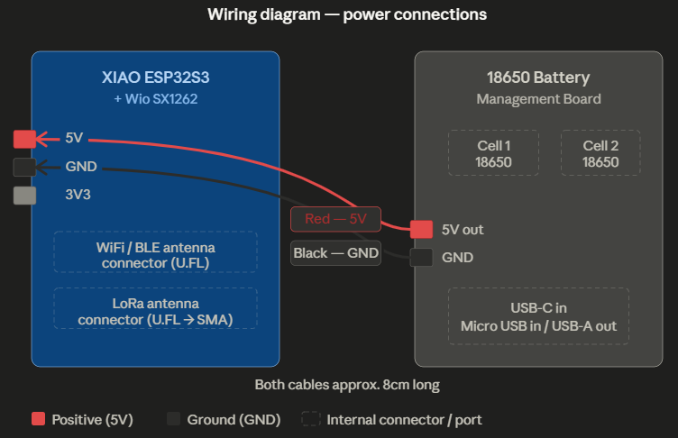

# Wiring Guide ⚡

The wiring for this device is extremely simple — 
just two cables connecting the battery board to the LoRa module.
That's it. Seriously.

## Power Connections

Solder two cables approximately **8cm long** onto the **5V power rail** 
of the 18650 battery management board:

| Wire | From | To | Colour |
|---|---|---|---|
| Positive | 5V out on battery board | 5V pin on XIAO ESP32S3 | Red |
| Ground | GND on battery board | GND pin on XIAO ESP32S3 | Black |

Attach **header pins** to the XIAO end of both cables so they plug 
directly into the XIAO module's pin headers cleanly and can be 
unplugged easily for servicing.

⚡ **Double check polarity before connecting.** 
Positive to positive, negative to negative. 
Reversing this will damage the XIAO module instantly.

## Antenna Connections

| Connection | From | To |
|---|---|---|
| LoRa antenna | U.FL port on Wio SX1262 | SMA bulkhead connector on enclosure top |
| WiFi/BLE antenna | U.FL port on XIAO ESP32S3 | Antenna stuck to internal plastic plate |

The U.FL connectors are small and delicate — press straight down 
until you feel a click. Never force at an angle.

## Wiring Diagram

See the diagram in the repository images folder for a visual 
reference of all connections.

## Notes

- Keep cables to approximately 8cm — long enough to reach comfortably, 
  short enough not to bunch up inside the case
- The WiFi/BLE antenna sticks onto the internal plastic plate 
  which sits inside the front half of the case
- The LoRa antenna connects via a U.FL to SMA pigtail cable 
  which routes to the SMA bulkhead connector on the top of the enclosure
- No other wiring is required — all other connections 
  (USB charging, power button, battery indicator LEDs) are handled 
  internally by the battery management board itself
