# 📡 LoRa Meshtastic Device — lora-locke

> *"What if you could send messages across kilometres of countryside, through forests, over hills,*  
> *with no phone signal, no internet, and no monthly bill?"*  
> That's exactly what this project does. Welcome to the mesh. 🌐

---

## What Is This?

This is an open source, 3D printed handheld LoRa Meshtastic communication node. It was designed and built as part of an **HNC Engineering Design (Unit 4001)** college project, but it turned into something genuinely useful — a pocket sized, off grid communication device that actually works in the real world.

The device is built around the **Seeed XIAO ESP32S3 + Wio SX1262 kit** from The Pi Hut, powered by dual hot swappable 18650 batteries, and housed in a custom designed 3D printed PLA enclosure with a detachable external SMA antenna. It talks to your phone over Bluetooth via the free **Meshtastic app**, and it can communicate with other Meshtastic nodes up to several kilometres away with absolutely no infrastructure whatsoever.

No towers. No SIM card. No subscription. Just radio waves and clever firmware.

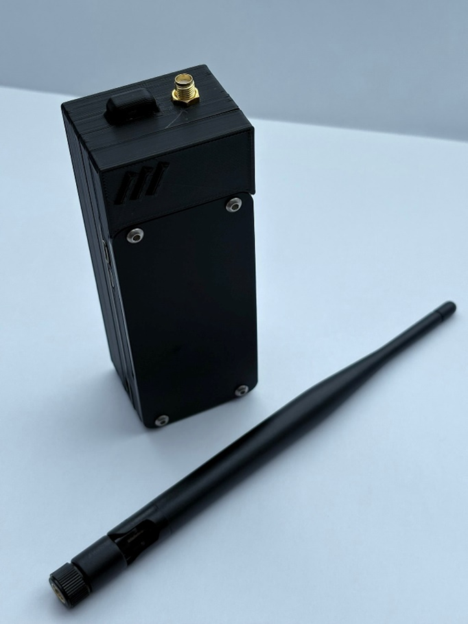

---

## Why Does This Exist?

Good question. The short answer: because conventional communication infrastructure is fragile.

Mobile networks go down in emergencies. Rural areas have black spots the size of small countries. Events with thousands of people bring networks to their knees. And if you've ever tried to coordinate a hiking group in the middle of nowhere, you'll know that shouting really doesn't scale well beyond about 50 metres.

Meshtastic LoRa devices are a genuinely viable solution for:

- 🏔️ **Outdoor adventures** — hiking, mountain biking, wild camping, expeditions
- 🚨 **Emergency preparedness** — resilient backup comms when infrastructure fails
- 🎪 **Events and festivals** — coordinate teams without relying on congested networks
- 🌍 **Remote IoT deployments** — sensor networks in areas without connectivity
- 🔬 **Experimentation** — because building your own radio network is genuinely cool

This isn't a niche hobbyist toy. As infrastructure resilience becomes more important, decentralised mesh communication networks like Meshtastic represent a genuinely compelling backup safety communication solution. A handful of these devices distributed across a team or community creates a self healing, self extending communication network that requires nothing external to operate.

---

## How Does Meshtastic Work?

Meshtastic uses **LoRa (Long Range)** radio to create a mesh network. Each device acts as both a client and a router — when you send a message, nearby nodes receive it and automatically forward it along until it reaches its destination. The more nodes on the network, the further messages can travel.

Think of it like a game of Chinese whispers, except it actually works and the message arrives intact. 📨

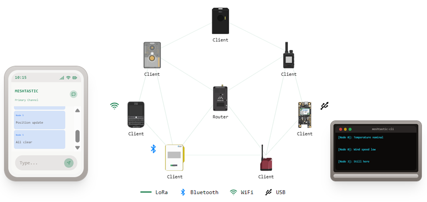

Each node operates on licence exempt frequencies (863–870 MHz in the UK, governed by Ofcom IR 2030 and ETSI EN 300 220), meaning anyone can use one legally without a radio licence.

For the full technical deep dive, the Meshtastic documentation is excellent:
👉 [meshtastic.org/docs/introduction](https://meshtastic.org/docs/introduction/)

---

## Features

- 📡 LoRa mesh communication via Meshtastic (862–930 MHz)
- 📱 Bluetooth app control — no screen needed, your phone is the interface
- 🔋 Dual 18650 hot swappable batteries — up to 30 hours runtime tested
- ⚡ USB-A power output — doubles as a power bank for your phone
- 🔌 USB-C and Micro USB charging inputs
- 🧲 Magnetic battery panel — tool free battery swaps in seconds, one cell at a time
- 📶 Detachable external SMA antenna — remove for pocket carry, attach for max range
- 🔴 Battery indicator LEDs — check charge status at a glance
- 🖨️ Fully 3D printable PLA enclosure
- 🌍 Completely open source hardware and software

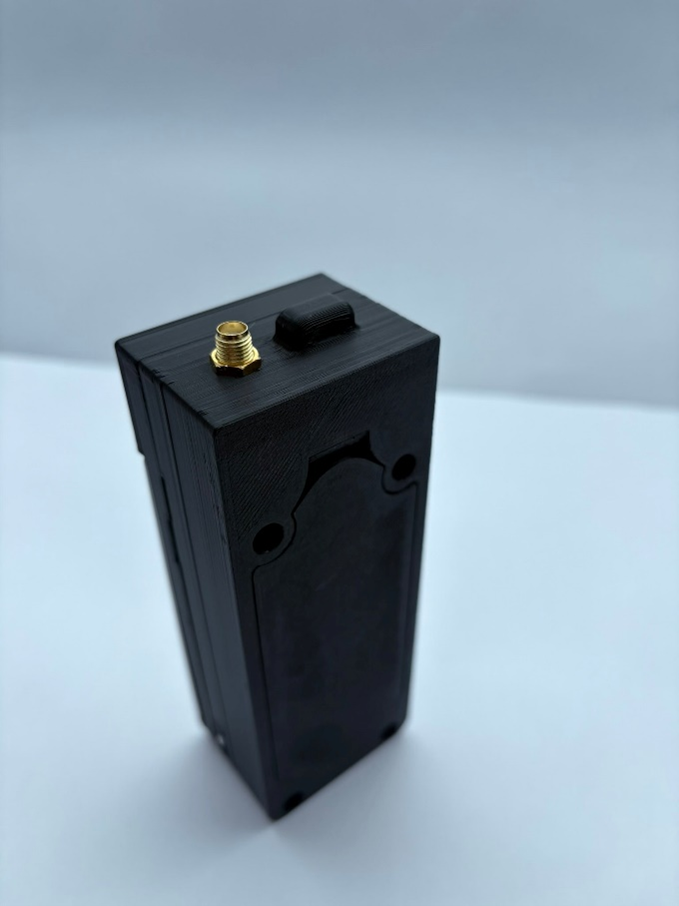

---

## The Design Journey

This project went through three design iterations before landing on the final build. The full engineering process — including SolidWorks CAD models, structural force studies, design considerations across 15 criteria, and a weighted Pugh matrix evaluation — is documented in the accompanying college assignment report.

Here's the short version:

---

### Design 1 — The Brick 🧱

The first attempt. Functional, but at 105mm x 45mm x 50mm it was more portable safe than portable device. The battery board and LoRa module were stacked vertically inside the enclosure, which meant the height was completely impractical. Great as a fixed infrastructure node. Terrible in a pocket. Back to SolidWorks.

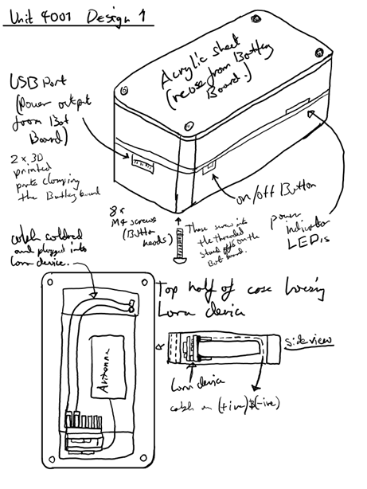
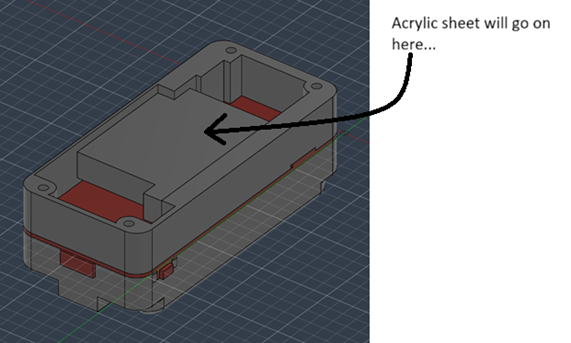

---

### Design 2 — Getting There 📐

Rotated the internal layout so the battery board and LoRa module sit side by side instead of stacked on top of each other. Result: 130mm x 50mm x 35mm — noticeably slimmer and much more natural to hold. A SolidWorks Simulation force study was run on this design to simulate drop loading and identify stress concentration points at the enclosure corners, which directly informed the geometry decisions in Design 3.

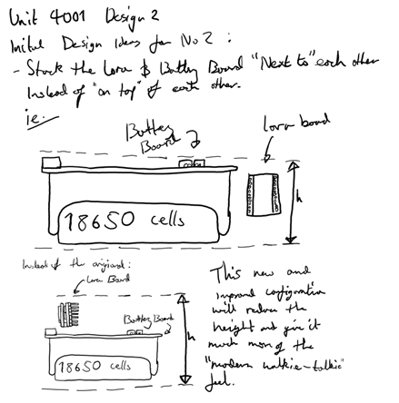
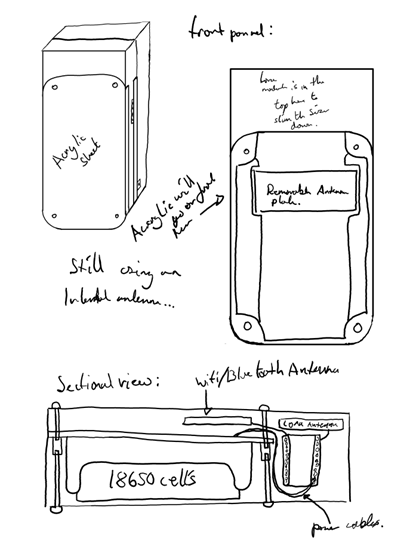
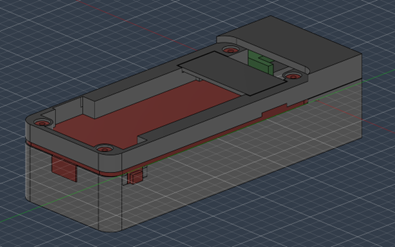
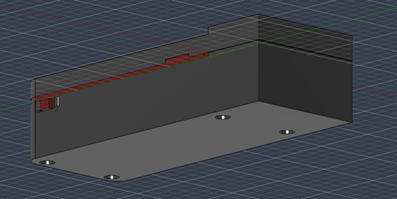
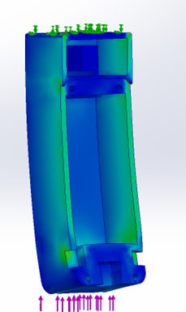
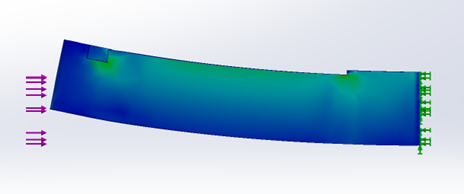

---

### Design 3 — The One That Actually Works ✅

Same core dimensions as Design 2 but with two targeted improvements that make a significant real world difference:

1. **Detachable external SMA antenna** — remove it when pocketing the device, screw it on when you need maximum RF performance. Best of both worlds.
2. **Magnetic hot swap battery panel** — four neodymium magnets retain the battery cover, meaning you can swap 18650 cells in the field in seconds without any tools. One cell at a time, so you never even have to power the device down.

This is the design documented in this repository. This is the one you should build.

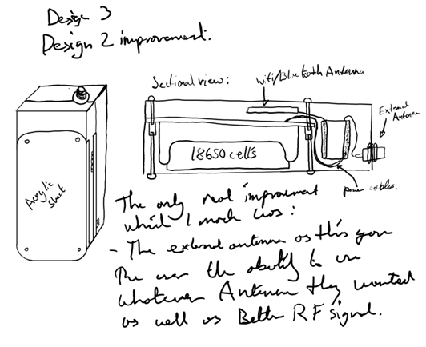
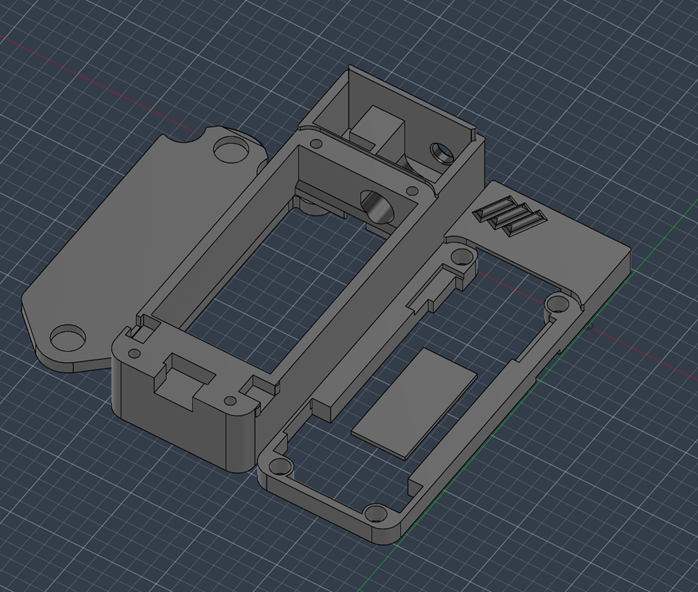


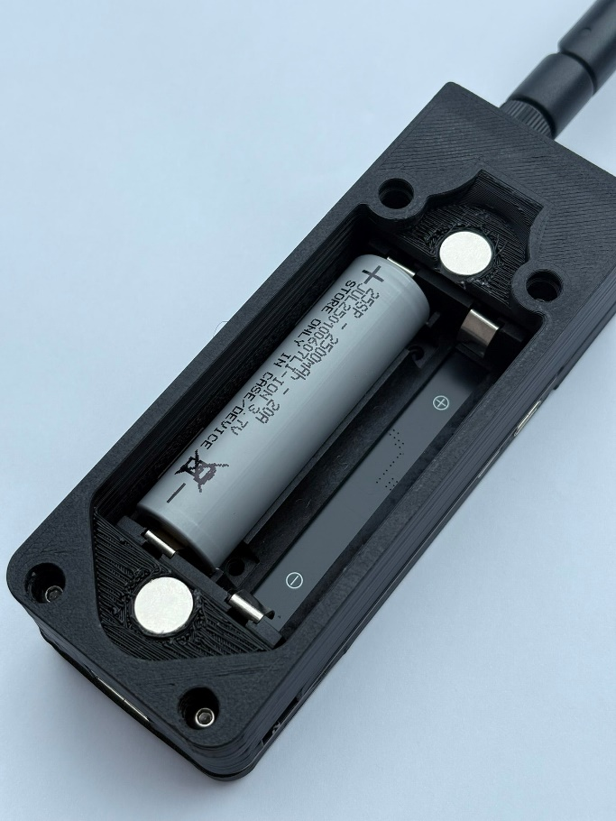
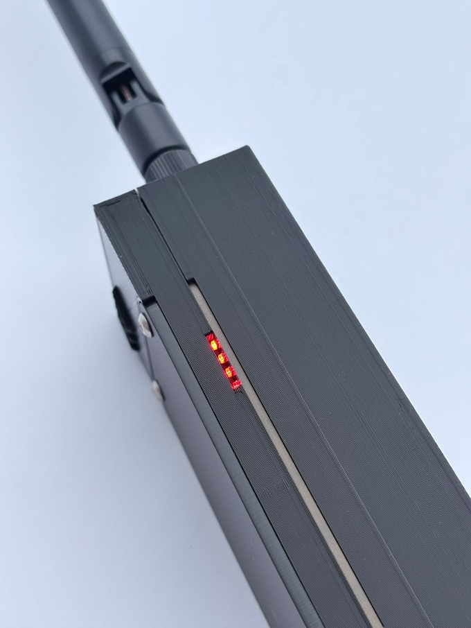
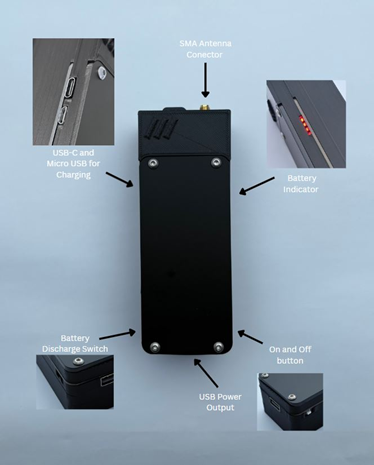

---

## What You Need to Build One

### Electronics

| Component | Supplier | Approx Cost |
|---|---|---|
| XIAO ESP32S3 + Wio SX1262 Kit | [The Pi Hut](https://thepihut.com/products/xiao-esp32s3-wio-sx1262-kit-for-meshtastic-lora) | £10.50 |
| 2-Way 18650 Battery Management Board | [The Pi Hut](https://thepihut.com/products/2-way-18650-battery-holder) | £8–£15 |
| 2x 18650 Li-Ion Cells | Any reputable supplier — not included | £5–£15 |
| SMA Female Bulkhead Connector | Amazon / AliExpress | £1–£3 |
| U.FL to SMA Pigtail Cable | Amazon / AliExpress | £1–£3 |
| 868MHz SMA Whip Antenna | Amazon / AliExpress | £2–£5 |
| M4 Button Head Screws x8 | Local hardware store | £1 |
| Neodymium Magnets x4 (~10mm dia) | Amazon / AliExpress | £2–£4 |
| **Total** | | **~£30–£55** |

### Tools and Materials

- FDM 3D printer (any well calibrated machine)
- Matte black PLA filament
- Small Phillips head screwdriver
- Soldering iron and solder
- Wire strippers
- Superglue (for magnets)

---

## How to Print the Enclosure

All STL files are in the `/CAD` folder of this repository.

**Recommended print settings:**

| Setting | Value |
|---|---|
| Material | PLA or PLA+ |
| Layer height | 0.2mm |
| Wall thickness | 2.4mm minimum |
| Infill | 20% honeycomb minimum |
| Supports | Required for some features |
| Orientation | Primary load bearing faces parallel to print bed |

> If you're in a hot climate or leaving the device in a car, use PETG instead of PLA.
> PLA softens at around 55°C which is a bad day for your enclosure. 🌞

---

## How to Flash Meshtastic

The XIAO ESP32S3 + Wio SX1262 kit from The Pi Hut comes **pre-flashed** with Meshtastic firmware straight out of the box. You probably won't need to do anything here at all.

If you do need to update or reflash:

1. Go to 👉 [flasher.meshtastic.org](https://flasher.meshtastic.org)
2. Connect your device via USB-C
3. Select **XIAO ESP32S3** as your device
4. Click Flash and wait about 30 seconds
5. Done. Seriously, that's it.

Full flashing guide with troubleshooting is in `/Firmware/flashing_guide.md`.

---

## How to Use It

1. Insert two 18650 cells into the battery compartment and close the magnetic panel
2. Press the power button on the top of the device
3. Download the **Meshtastic app** on your phone — iOS or Android, it's free
4. Open the app, go to Bluetooth, and pair with your device
   - Default PIN: **123456**
5. Set your region to **EU_868** for UK use
6. Screw on the SMA antenna
7. You're on the mesh 🎉

From the app you can send messages, see other nodes on a map, configure channels, check battery level, and adjust all settings. The device itself needs no further interaction — one button to rule them all.

---

## Assembly Guide

A full step by step assembly guide is in `/Docs/assembly_guide.md`.

The short version:
1. Superglue magnets into pockets in the main body and battery panel — check polarity first!
2. Install SMA bulkhead connector in the top of the front half
3. Stick the WiFi/BLE antenna to the internal plastic plate
4. Solder two 8cm power cables onto the 5V rail of the battery board
5. Fit the battery board into the back half and secure with four M4 screws
6. Slot the XIAO module into the top of the front half, connect power cables, antenna pigtail and WiFi antenna
7. Test before closing — always
8. Bring both halves together, slide in the internal plate, push in the acrylic sheet, drive the remaining four screws
9. Clip on the magnetic battery panel, screw on the antenna, power on 📡

---

## Repository Structure

```
lora-locke/
├── README.md                        — You are here
├── images/                          — All photos and diagrams
├── CAD/
│   ├── README.md                    — Print settings and file info
│   └── Meshtastic Device 3D.stl    — 3D printable enclosure
├── Firmware/
│   └── flashing_guide.md            — How to flash Meshtastic
└── Docs/
    ├── assembly_guide.md            — Full build instructions
    ├── wiring_guide.md              — Power connections
    ├── BOM.md                       — Full bill of materials
    └── PDS.md                       — Original college project design specification
```

---

## Project Context

This project was completed as part of an **HNC Engineering (Level 4) — Unit 4001 Engineering Design** assignment. The brief required the design and development of a sustainable, cost effective product through a structured iterative engineering design process.

If you're a student looking at this as an example — hi 👋 — the key things the assignment covered were:

- Product Design Specification (PDS) with stakeholder analysis
- Project planning with Gantt chart and Critical Path Analysis
- Three iterative design concepts modelled in SolidWorks
- Structural analysis using SolidWorks Simulation force study
- Design evaluation using a weighted Pugh matrix across 15 criteria
- Design considerations covering material, lifecycle, repairability, sustainability, ergonomics, standards compliance, and more
- A formal engineering design report

The full written assignment and design specification are included in the `/Docs` folder for reference.

---

## Licence

This project is released under the **MIT Licence** — do whatever you want with it, just give a nod to the original. See `LICENSE` for the full terms.

The Meshtastic firmware is a completely separate open source project — full credit and attribution to the Meshtastic team and the incredible community behind it.
👉 [meshtastic.org](https://meshtastic.org)

---

## A Note on Safety Communication

Meshtastic is not a replacement for emergency services. If someone is in danger, call 999.

What it genuinely is useful for is **resilient backup communication** in situations where conventional infrastructure is unavailable, degraded, or congested. A small network of Meshtastic devices provides an infrastructure independent communication layer that costs very little to deploy, requires no ongoing subscription or maintenance, and works anywhere there's line of sight or a mesh of nodes.

For event safety teams, mountain rescue support groups, remote work crews, and outdoor enthusiasts — it's worth thinking about seriously.

---

*Built with SolidWorks, printed in PLA, powered by 18650s, and fuelled by an unhealthy interest in radio waves. 📡*
